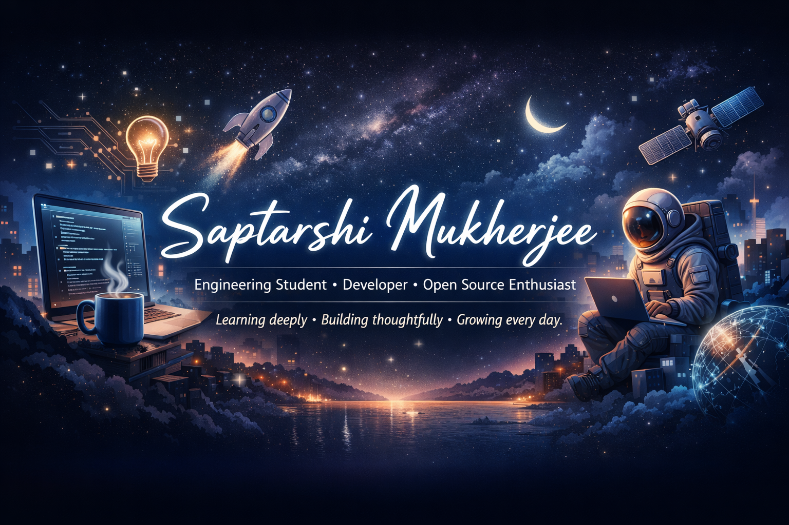

# Hello there,

<div>
  
[](https://git.io/typing-svg)
</div>

<h1>About Me:</h1>
<p>
  🚀 I am a <strong>Software Engineer</strong> specializing in building intelligent, scalable solutions at the intersection of <strong>AI, Machine Learning, and Full-Stack Development</strong>. <br>
  💡 Passionate about transforming complex business requirements into high-performance code and optimizing DevOps lifecycles for seamless delivery. <br>
  🎓 Constantly evolving with cutting-edge technologies and contributing to open-source innovation.
</p>

I am dedicated to building solutions that make a difference in the tech world and beyond!

[](https://github.com/Sappymukherjee214)


## 🚀 What I'm Working On:

- 🤖 Exploring **AI & Machine Learning** - Building intelligent systems
- 💻 Developing **Full-Stack Applications** - From frontend to backend
- ⚙️ Learning **DevOps Practices** - CI/CD, Containerization, Cloud
- 🔥 Contributing to **Open Source** - Growing with the community


## 📊 Stats:

<br/>


## 🛠️ Featured Projects:

<div align="center">

| Project | Description | Tech Stack |
| :--- | :--- | :--- |
| **🛡️ PrivGPT-Studio** | Private AI/LLM integration studio for secure inference and development. | `Python` `React` `FastAPI` |
| **📖 GroqTales** | High-performance storytelling engine powered by LPU™ technology. | `Next.js` `Groq API` `Tailwind` |
| **📊 LeetCode Pro** | Automated tracker for company-specific problem solving and patterns. | `TypeScript` `Github Actions` |

</div>

<p align="center">
  <a href="https://github.com/Sappymukherjee214?tab=repositories">
    
  </a>
</p>

</div>


## 💻 Tech Stack:

<h3 align="left">Languages & Frameworks</h3>
<p align="left">
  <a href="https://skillicons.dev">
    
  </a>
</p>

<h3 align="left">Web Development</h3>
<p align="left">
  <a href="https://skillicons.dev">
    
  </a>
</p>

<h3 align="left">AI/ML & Data Science</h3>
<p align="left">
  <a href="https://skillicons.dev">
    
  </a>
</p>

<h3 align="left">Databases & Cloud</h3>
<p align="left">
  <a href="https://skillicons.dev">
    
  </a>
</p>

<h3 align="left">DevOps & Tools</h3>
<p align="left">
  <a href="https://skillicons.dev">
    
  </a>
</p>

<h3 align="left">Dev Tools</h3>
<p align="left">
  <a href="https://skillicons.dev">
    
  </a>
</p>


## 🧠 Engineering Deep Dive:

<details>
<summary><b>🛠️ My Development Philosophy</b></summary>
<br>
<blockquote>
  "Code is for humans to read, and only incidentally for machines to execute."
</blockquote>
<ul>
  <li><b>Clean Architecture:</b> I prioritize logic separation and maintainable patterns over quick hacks.</li>
  <li><b>Automation First:</b> If a task needs to be done twice, it deserves a script/workflow.</li>
  <li><b>AI-Assisted, Not AI-Dependent:</b> Leveraging LLMs to accelerate boilerplate while maintaining deep focus on core logic and security.</li>
</ul>
</details>

<details>
<summary><b>🖥️ My Productivity Stack</b></summary>
<br>
<ul>
  <li><b>Editor:</b> VS Code (Tokyo Night Theme + Fira Code font)</li>
  <li><b>Terminal:</b> PowerShell / Oh My Zsh (Spaceship Prompt)</li>
  <li><b>Cloud Environment:</b> AWS / Vercel / Railway</li>
  <li><b>Must-Have Tools:</b> Postman (API testing), Docker (Isolation), Figma (UI/UX)</li>
</ul>
</details>

<details>
<summary><b>🌱 Currently Exploration & Learning</b></summary>
<br>
<ul>
  <li><b>Distributed Systems:</b> Exploring Kubernetes orchestration for microservices.</li>
  <li><b>Advanced ML:</b> Fine-tuning transformer models for specific domain tasks.</li>
  <li><b>Web Performance:</b> Optimizing Core Web Vitals for progressive web apps.</li>
</ul>
</details>


## 😂 Coding Humor & 💡 Daily Inspiration:

<div align="center">
  
</div>

<br>

<div align="center">
  
</div>

<br>


## 🌐 Connect with Me:

[](https://www.linkedin.com/in/saptarshi-mukherjee-096191263/)
[](https://github.com/Sappymukherjee214)
[](mailto:mukherjeesaptarshi289@gmail.com)
[](https://x.com/MukherjeeXii)


## ⏱️ WakaTime Coding Stats

<!--START_SECTION:waka-->


**🐱 My GitHub Data** 

> 📦 10.6 kB Used in GitHub's Storage 
 > 
> 🏆 609 Contributions in the Year 2026
 > 
> 💼 Opted to Hire
 > 
> 📜 96 Public Repositories 
 > 
> 🔑 1 Private Repositories 
 > 
**I'm an Early 🐤** 

```text
🌞 Morning                0 commits           ░░░░░░░░░░░░░░░░░░░░░░░░░   00.00 % 
🌆 Daytime                0 commits           ░░░░░░░░░░░░░░░░░░░░░░░░░   00.00 % 
🌃 Evening                0 commits           ░░░░░░░░░░░░░░░░░░░░░░░░░   00.00 % 
🌙 Night                  0 commits           ░░░░░░░░░░░░░░░░░░░░░░░░░   00.00 % 
```
📅 **I'm Most Productive on Monday** 

```text
Monday                   0 commits           ░░░░░░░░░░░░░░░░░░░░░░░░░   00.00 % 
Tuesday                  0 commits           ░░░░░░░░░░░░░░░░░░░░░░░░░   00.00 % 
Wednesday                0 commits           ░░░░░░░░░░░░░░░░░░░░░░░░░   00.00 % 
Thursday                 0 commits           ░░░░░░░░░░░░░░░░░░░░░░░░░   00.00 % 
Friday                   0 commits           ░░░░░░░░░░░░░░░░░░░░░░░░░   00.00 % 
Saturday                 0 commits           ░░░░░░░░░░░░░░░░░░░░░░░░░   00.00 % 
Sunday                   0 commits           ░░░░░░░░░░░░░░░░░░░░░░░░░   00.00 % 
```


📊 **This Week I Spent My Time On** 

```text
🕑︎ Time Zone: Asia/Kolkata

💬 Programming Languages: 
Other                    13 hrs 40 mins      ████████████████████░░░░░   79.39 % 
Markdown                 3 hrs 32 mins       █████░░░░░░░░░░░░░░░░░░░░   20.61 % 

🔥 Editors: 
Chrome                   17 hrs 13 mins      █████████████████████████   100.00 % 

🐱‍💻 Projects: 
SOUL_SENSE_EXAM          15 hrs 19 mins      ██████████████████████░░░   89.01 % 
GSoC-2026-explorer       1 hr 53 mins        ███░░░░░░░░░░░░░░░░░░░░░░   10.94 % 
travellers               0 secs              ░░░░░░░░░░░░░░░░░░░░░░░░░   00.06 % 

💻 Operating System: 
Windows                  17 hrs 13 mins      █████████████████████████   100.00 % 
```

```text

```


 Last Updated on 01/03/2026 04:53:08 UTC
<!--END_SECTION:waka-->


<picture>
  <source media="(prefers-color-scheme: dark)" srcset="https://raw.githubusercontent.com/Sappymukherjee214/Sappymukherjee214/output/github-snake-dark.svg" />
  <source media="(prefers-color-scheme: light)" srcset="https://raw.githubusercontent.com/Sappymukherjee214/Sappymukherjee214/output/github-snake.svg" />
  
</picture>


<!-- FOOTER -->
<p align="center w-screen">
  
</p>
